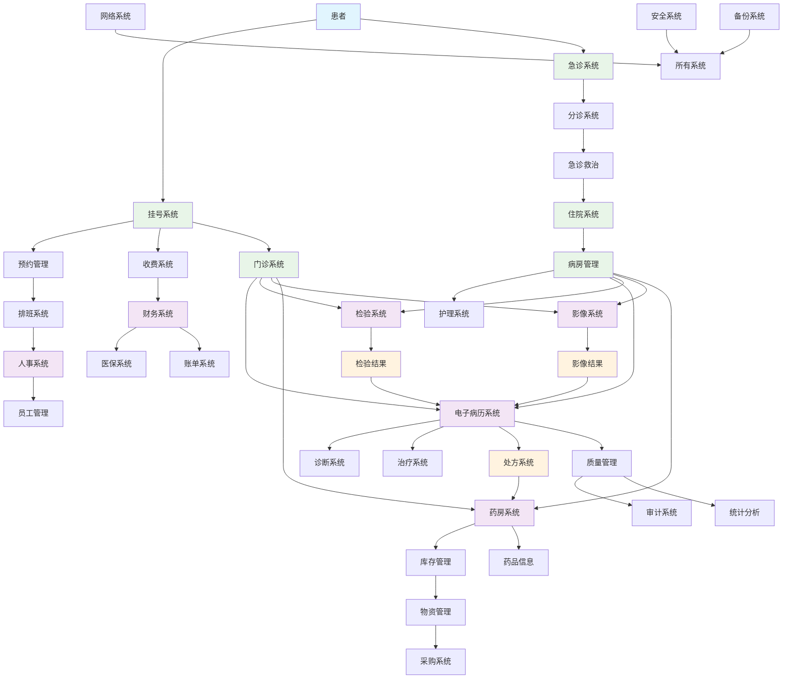
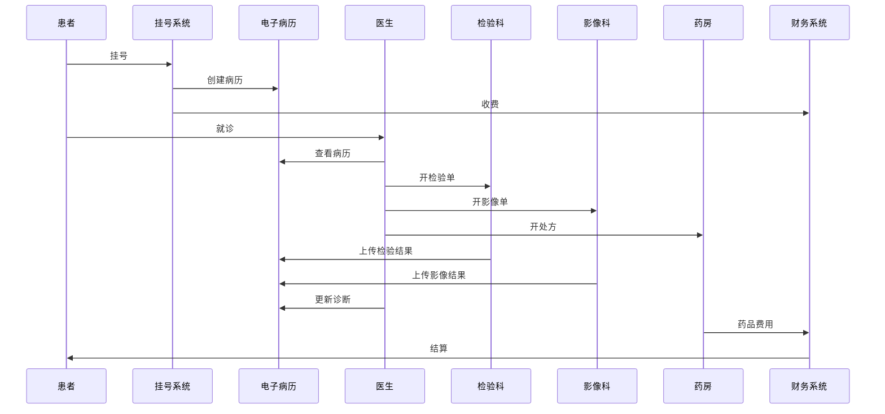
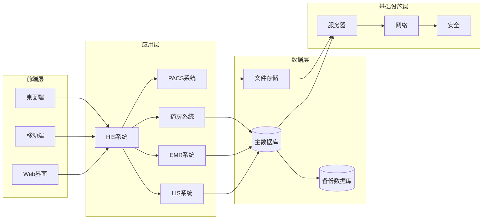

# 医院业务流程和信息系统UML图

## 医院整体业务流程和信息系统架构图

## 详细业务流程时序图

## 医院信息系统架构图

## 主要业务流程说明

### 1. 患者就诊流程
- **挂号** → **分诊** → **就诊** → **检查** → **诊断** → **治疗** → **取药** → **结算**

### 2. 住院流程
- **入院** → **病房分配** → **治疗** → **护理** → **检查** → **用药** → **出院** → **结算**

### 3. 急诊流程
- **急诊挂号** → **分诊** → **紧急救治** → **检查** → **治疗** → **住院/出院**

### 4. 医技科室流程
- **接收申请** → **检查** → **结果录入** → **报告生成** → **结果推送**

### 5. 药房流程
- **接收处方** → **审核** → **配药** → **发药** → **库存更新**

### 6. 财务流程
- **收费** → **医保结算** → **账单生成** → **财务报表**

## 系统集成关系

- **HIS系统**：医院信息系统的核心，管理患者信息和业务流程
- **EMR系统**：电子病历系统，存储和管理患者医疗记录
- **LIS系统**：实验室信息系统，管理检验流程和结果
- **PACS系统**：影像归档和通信系统，管理医学影像
- **PIS系统**：药房信息系统，管理药品和处方
- **财务系统**：管理医院财务和收费
- **人事系统**：管理医院员工信息
- **物资系统**：管理医院物资和采购 